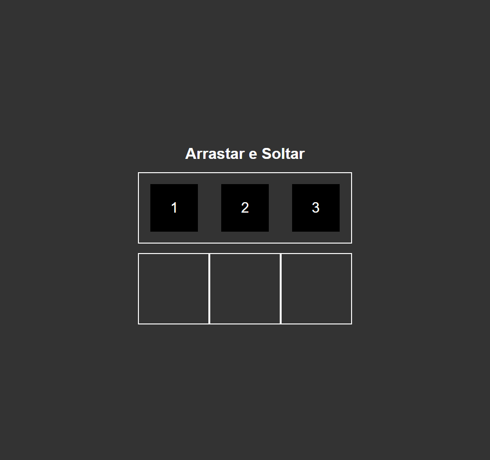
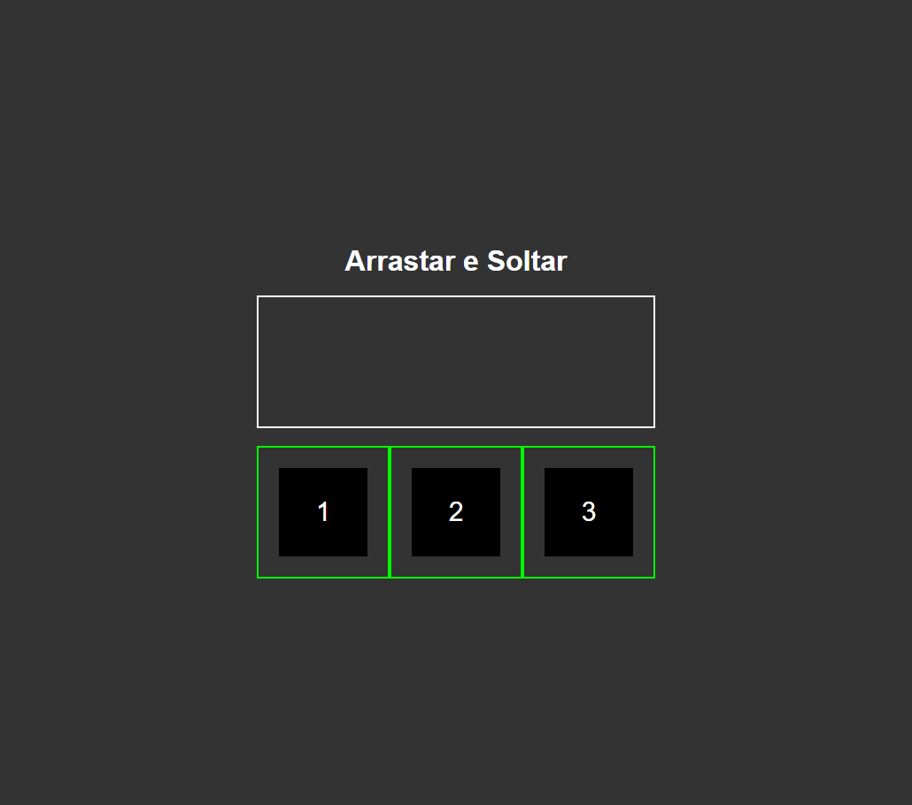
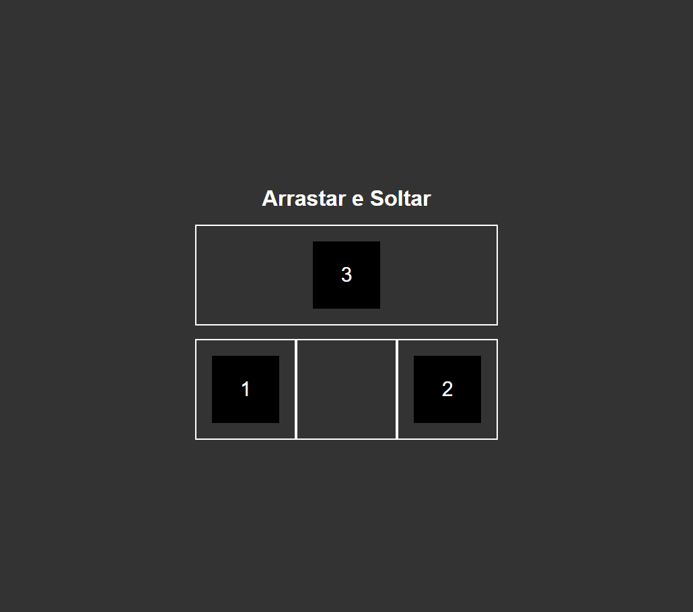

  
  
  

<h4 align="center"> 
	🚧 Drag and Drop - Concluído 🚀 🚧
</h4>

## Sobre o projeto

Projeto prático de estudo desenvolvido com o intuito de aplicar meus conhecimentos com foco maior no "Javascript" sem deixar de lado o **HTML5 e CSS3**

---

## Projeto desenvolvido

---
